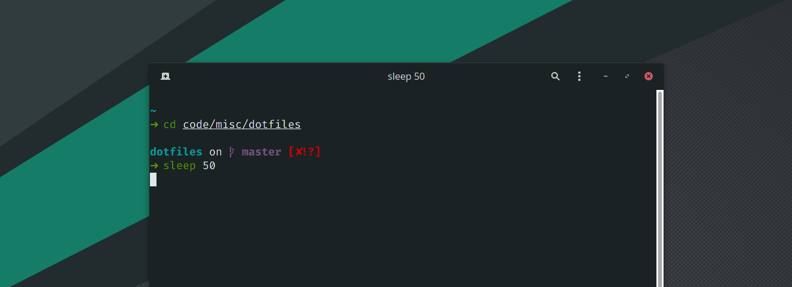

# dotfiles

A set of configuration files to setup my MacOS system. These should work on Linu MacOS.



## Table of contents

- [Homebrew](#homebrew)
- [Fonts](#fonts)
- [git](#git)
- [vim](#vim)
- [zsh](#zsh)
- [Cursor](#cursor)
- [Miscellaneous tasks](#miscellaneous-tasks)

## Homebrew

```sh
bash -c "$(curl -fsSL https://raw.githubusercontent.com/Homebrew/install/HEAD/install.sh)"
```

## Fonts

- [Monaspace](https://monaspace.githubnext.com/)

```sh
brew install font-monaspace
```

## git

- Install [git](https://git-scm.com/book/en/v2/Getting-Started-Installing-Git) (might be pre-installed)
- Copy config files

```sh
cp git/gitconfig ~/.gitconfig
```

## vim

- Install [vim](https://www.vim.org/) (might be pre-installed)
- Copy config files

```sh
cp vim/vimrc ~/.vimrc
```

- When a new file is opened for the first time after updating `~/.vimrc`,
  [vim-plug](https://github.com/junegunn/vim-plug) is installed for managing vim plugins.

## Essentials

- [Arc Browser](https://arc.net/)
- [iTerm2](https://iterm2.com/)
- [Notion Calendar](https://www.notion.so/product/calendar)
- [Raycast](https://www.raycast.com/)
- [Logi Options+](https://www.logitech.com/en-in/software/logi-options-plus.html)
- [command-not-found](https://github.com/Homebrew/homebrew-command-not-found)
- [fzf](https://github.com/junegunn/fzf)
- [ripgrep](https://github.com/BurntSushi/ripgrep): recursively searches directories for a regex
  pattern
- [fd](https://github.com/sharkdp/fd): a simple, fast and user-friendly alternative to 'find'
- [delta](https://github.com/dandavison/delta): a syntax-highlighting pager for git, diff, and grep output
- [bat](https://github.com/sharkdp/bat): cat(1) clone with wings
- [bat-extras](https://github.com/eth-p/bat-extras): a collection of modern/faster/saner alternatives to common unix commands
- [broot](https://github.com/Canop/broot): a new way to navigate directory trees
- [dust](https://github.com/bootandy/dust): a more intuitive version of du in rust
- [duf](https://github.com/muesli/duf): a disk usage/free utility - a better 'df' alternative
- [procs](https://github.com/dalance/procs): a modern replacement for ps written in Rust
- [httpie](https://github.com/httpie/httpie): a modern, user-friendly command-line HTTP client for the API era
- [dog](https://github.com/ogham/dog): a command-line DNS client

## zsh

- Install the following
  - [zsh](https://github.com/robbyrussell/oh-my-zsh/wiki/Installing-ZSH)
  - [starship](https://starship.rs/)
  - [zsh-syntax-highlighting](https://github.com/zsh-users/zsh-syntax-highlighting/blob/master/INSTALL.md#oh-my-zsh)
  - [zsh-autosuggestions](https://github.com/zsh-users/zsh-autosuggestions/blob/master/INSTALL.md#oh-my-zsh)
  - [Raycast Light Theme](https://raw.githubusercontent.com/mbadolato/iTerm2-Color-Schemes/master/schemes/Raycast_Light.itermcolors)
  - [Raycast Dark Theme](https://raw.githubusercontent.com/mbadolato/iTerm2-Color-Schemes/master/schemes/Raycast_Dark.itermcolors)

- Change font in profile to Monaspace
- Change light theme to Raycast Light
- Change dark theme to Raycast Dark
- Set zsh as your login shell

```sh
chsh -s $(which zsh)
```

- Copy config files

```sh
mkdir -p ~/.config
cp -r zsh/config/* ~/.config/
```

- Copy zsh files

```sh
mkdir -p ~/.zsh
cp -r zsh/*.zsh ~/.zsh/
```

- Add this line at the top of `~/.zshrc`

```sh
source $HOME/.zsh/main.zsh
```

- Source zshrc

```sh
source ~/.zshrc
```

## Cursor

- Install [Cursor](https://cursor.sh/)
- Install extensions

```sh
bash cursor/install-extensions.sh
```

- Copy config files

```sh
cp cursor/settings.json ~/Library/Application\ Support/Cursor/settings.json
```

### Maintenance

- Update `cursor/install-extensions.sh`

```sh
cursor --list-extensions | xargs -L 1 echo cursor --install-extension > cursor/install-extensions.sh
```

- Update `cursor/settings.json`

```sh
cp ~/Library/Application\ Support/Cursor/User/settings.json cursor/settings.json
```

## Miscellaneous tasks

- Set Arc as the default browser
- Set Notion Calendar as the default calendar. Turn on notifications
- Bind Raycast to `Cmd+Space` instead of Spotlight
