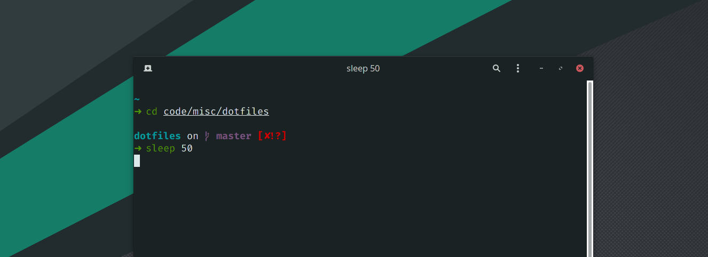

# dotfiles

A set of configuration files to setup my macOS system.



## Table of contents

- [Quick setup](#quick-setup)
- [What's included](#whats-included)
- [Manual steps](#manual-steps)
- [Maintenance](#maintenance)

## Quick setup

```sh
bash setup.sh
```

The setup script automatically:

- Installs [Homebrew](https://brew.sh/) if missing
- Installs all CLI tools and casks via brew
- Copies config files (git, vim, zsh, starship, Ghostty)
- Sets up `~/.zshrc`
- Sets zsh as the login shell
- Configures macOS defaults (Finder, Dock, keyboard, screenshots)
- Reloads Ghostty config

## What's included

### Fonts

- [Monaspace](https://monaspace.githubnext.com/) — installed via `brew install --cask font-monaspace`

### git

- Config with [delta](https://github.com/dandavison/delta) pager (Dracula theme), modern defaults (`zdiff3`, `histogram` diffs, `rerere`, auto-prune, rebase on pull), and useful aliases
- Copied to `~/.gitconfig`

### vim

- Config with [vim-plug](https://github.com/junegunn/vim-plug) and plugins:
  - [NERDTree](https://github.com/preservim/nerdtree), [fzf.vim](https://github.com/junegunn/fzf.vim), [vim-gitgutter](https://github.com/airblade/vim-gitgutter), [vim-fugitive](https://github.com/tpope/vim-fugitive)
  - [vim-commentary](https://github.com/tpope/vim-commentary), [vim-surround](https://github.com/tpope/vim-surround), [vim-repeat](https://github.com/tpope/vim-repeat), [auto-pairs](https://github.com/jiangmiao/auto-pairs)
  - [vim-polyglot](https://github.com/sheerun/vim-polyglot), [vim-go](https://github.com/fatih/vim-go), [rust.vim](https://github.com/rust-lang/rust.vim)
  - [vim-airline](https://github.com/vim-airline/vim-airline), [editorconfig-vim](https://github.com/editorconfig/editorconfig-vim)
- Settings: relative line numbers, persistent undo, smart case search, space leader key
- Copied to `~/.vimrc`
- On first open, vim-plug auto-installs plugins

### zsh

- Modular config: aliases, completions, history, key-bindings, plugins, and more
- [starship](https://starship.rs/) prompt
- Plugins: [zsh-syntax-highlighting](https://github.com/zsh-users/zsh-syntax-highlighting), [zsh-autosuggestions](https://github.com/zsh-users/zsh-autosuggestions), [fzf](https://github.com/junegunn/fzf), [zoxide](https://github.com/ajeetdsouza/zoxide), [atuin](https://github.com/atuinsh/atuin)
- Copied to `~/.zsh/` and `~/.config/`

### Ghostty

- [Ghostty](https://ghostty.org/) terminal with GitHub Dark theme and Monaspace font
- Native tab bar, split pane keybindings, shell integration, copy-on-select
- Config copied to `~/.config/ghostty/config`

### Zed

- [Zed](https://zed.dev/) editor — installed via `brew install --cask zed`

### CLI tools (installed via brew)

**Terminal multiplexer:**
- [tmux](https://github.com/tmux/tmux) — terminal multiplexer

**Search and navigation:**
- [fzf](https://github.com/junegunn/fzf) — fuzzy finder
- [ripgrep](https://github.com/BurntSushi/ripgrep) — fast regex search
- [fd](https://github.com/sharkdp/fd) — simple, fast alternative to find
- [broot](https://github.com/Canop/broot) — interactive directory navigator
- [zoxide](https://github.com/ajeetdsouza/zoxide) — smarter cd that learns your habits

**Git tools:**
- [delta](https://github.com/dandavison/delta) — syntax-highlighting pager for git
- [lazygit](https://github.com/jesseduffield/lazygit) — terminal UI for git
- [difftastic](https://github.com/Wilfred/difftastic) — structural diff that understands syntax

**File viewing:**
- [bat](https://github.com/sharkdp/bat) — cat clone with wings
- [bat-extras](https://github.com/eth-p/bat-extras) — bat-powered scripts
- [glow](https://github.com/charmbracelet/glow) — render Markdown in the terminal

**System monitoring:**
- [htop](https://htop.dev/) — interactive process viewer
- [bottom](https://github.com/ClementTsang/bottom) — system monitor TUI (`btm`)

**Disk and process tools:**
- [dust](https://github.com/bootandy/dust) — intuitive du alternative
- [duf](https://github.com/muesli/duf) — better df alternative
- [procs](https://github.com/dalance/procs) — modern ps replacement

**Modern replacements:**
- [eza](https://github.com/eza-community/eza) — modern ls replacement
- [sd](https://github.com/chmln/sd) — simpler sed alternative
- [doggo](https://github.com/mr-karan/doggo) — modern DNS client

**Data processing:**
- [jq](https://github.com/jqlang/jq) — JSON processor
- [yq](https://github.com/mikefarah/yq) — YAML/TOML/XML processor

**Networking:**
- [httpie](https://github.com/httpie/httpie) — user-friendly HTTP client

**Development utilities:**
- [tokei](https://github.com/XAMPPRocky/tokei) — code statistics
- [hyperfine](https://github.com/sharkdp/hyperfine) — CLI benchmarking
- [watchexec](https://github.com/watchexec/watchexec) — execute commands on file changes
- [grex](https://github.com/pemistahl/grex) — generate regexes from examples
- [just](https://github.com/casey/just) — modern command runner (Makefile alternative)

**Help and docs:**
- [tlrc](https://github.com/tldr-pages/tlrc) — simplified man pages with examples (tldr client)

**Shell:**
- [atuin](https://github.com/atuinsh/atuin) — better shell history with fuzzy search
- [mise](https://github.com/jdx/mise) — version manager for dev tools (replaces nvm, pyenv, etc.)

### Apps (installed via brew cask)

- [Raycast](https://www.raycast.com/) — launcher and productivity tool
- [Rectangle](https://rectangleapp.com/) — window management
- [AppCleaner](https://freemacsoft.net/appcleaner/) — thorough app uninstaller
- [The Unarchiver](https://theunarchiver.com/) — open any archive format

### macOS defaults

The setup script configures:

- **Finder:** show hidden files, file extensions, path bar, status bar; list view; search current folder
- **Keyboard:** fast key repeat rate, disable press-and-hold for accent characters
- **Dock:** auto-hide with no delay, no recent apps
- **Screenshots:** save to `~/Screenshots` as PNG
- **Misc:** disable smart quotes/dashes, plain text TextEdit, show all processes in Activity Monitor

## Manual steps

These are not automated by the setup script:

- Install [Google Chrome](https://www.google.com/intl/en_in/chrome/) and set as default browser
- Install [Logi Options+](https://www.logitech.com/en-in/software/logi-options-plus.html)
- Install [Amphetamine](https://apps.apple.com/us/app/amphetamine/id937984704)
- Open [Raycast](https://www.raycast.com/), grant permissions, and [bind to `Cmd+Space` instead of Spotlight](https://manual.raycast.com/hotkey)
- Open [Rectangle](https://rectangleapp.com/), grant accessibility permissions, and configure preferred shortcuts
- Open [AppCleaner](https://freemacsoft.net/appcleaner/) and enable SmartDelete in preferences
- Add Google account to Calendar and Contacts apps
- Install [Dato](https://apps.apple.com/ph/app/dato/id1470584107) — menubar calendar

## Maintenance

Update config files from the system back to this repo:

```sh
cp ~/.gitconfig git/gitconfig
cp ~/.vimrc vim/vimrc
cp ~/.zsh/*.zsh zsh/
cp ~/.config/starship.toml zsh/config/starship.toml
cp ~/.config/ghostty/config ghostty/config
```
