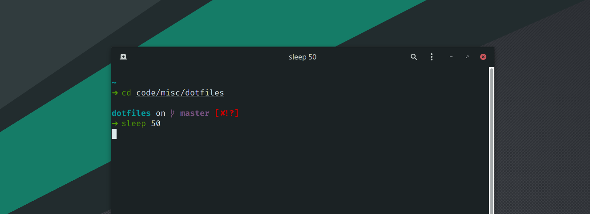

# dotfiles

A set of configuration files to set up my macOS system.



## Table of contents

- [Quick setup](#quick-setup)
- [Code layout](#code-layout)
- [What's included](#whats-included)
- [Manual steps](#manual-steps)
- [Updating](#updating)
- [Maintenance](#maintenance)

## Quick setup

```sh
bash setup.sh
```

`setup.sh` runs one script per step, in this order. Each is `<step>/install.sh` and also runs on its own:

| Step | What it does |
| :- | :- |
| `homebrew` | Installs the Xcode Command Line Tools, [Homebrew](https://brew.sh/), and every formula, cask, and App Store app listed below |
| `runtimes` | Installs Node LTS and Go with mise, and Rust with rustup |
| `git` | Copies the git config, global ignore file and `git cleanup` script, and offers to log in to GitHub with `gh` |
| `lazygit` | Copies the lazygit config |
| `ssh` | Adds the `github.com` block to `~/.ssh/config` if it has none |
| `zsh` | Copies the zsh and starship config, adds lines to `~/.zshrc` and `~/.zprofile`, and makes zsh the login shell |
| `vim` | Copies the vim config |
| `tmux` | Copies the tmux config and `tmux-sessionizer`, and installs tpm and the plugins |
| `ghostty` | Copies the Ghostty config and reloads it |
| `zed` | Copies the Zed settings and keymap |
| `editorconfig` | Copies `~/.editorconfig` |
| `macos` | Sets macOS defaults (Finder, Dock, keyboard, screenshots) |

To run only some steps, name them. `--help` lists the steps:

```sh
bash setup.sh git zsh
bash git/install.sh     # the same step, run directly
```

It's safe to re-run: steps that are already applied say so and change nothing. Config files are copied over the installed ones, except files that other tools also edit (`~/.zshrc`, `~/.zprofile`, `~/.ssh/config`, `~/.gitconfig`), which only get the lines they're missing.

AI tools have their own script. See [ai_tools/README.md](./ai_tools/README.md):

```sh
bash ai_tools/setup.sh
```

After Homebrew is installed, the [justfile](./justfile) wraps these:

```sh
just setup [step...]      # bash setup.sh
just setup-ai [step...]   # bash ai_tools/setup.sh
just git-signing          # bash git/setup-signing.sh, see "Commit signing"
just check                # shellcheck every script and syntax-check the zsh files
```

## Code layout

Projects live at `~/Dev/<group>/<project>`, grouped by language or purpose: `~/Dev/go/envl`, `~/Dev/js/jslib`, `~/Dev/python/...`. This repo is at `~/Dev/setup/dotfiles`.

T3 Code puts worktrees under `~/.t3/worktrees/<repo>/<worktree>`.

`ts` in zsh and `prefix+f` in tmux pick a project from `~/Dev/*/*` and open a tmux session for it. See [tmux](#tmux).

## What's included

### Fonts

- [Monaspace](https://monaspace.githubnext.com/) — installed via `brew install --cask font-monaspace`

### git

- Config with [delta](https://github.com/dandavison/delta) pager (Dracula theme), modern defaults (`zdiff3`, `histogram` diffs, copy and rename detection, `rerere` with auto-staging, `updateRefs` and auto-squash on rebase, verbose commits, fsmonitor, auto-prune, rebase on pull, human-readable log dates, `--force-with-lease` that also needs the remote tip to be in your reflog, object checks on fetch), and useful aliases
- `help.autocorrect = prompt` asks before running a corrected command
- [difftastic](https://github.com/Wilfred/difftastic) as the diff tool: `git dft` and `git dd` show the working tree diff, `git dlog` shows the log with structural diffs
- `git cob` and `git cobr` pick a local or remote branch with fzf and switch to it. A remote branch gets a local tracking branch.
- `git co` runs `switch`, `git unstage` runs `restore --staged`, and `git del` deletes a branch only if it's merged
- `git cleanup` deletes local branches already merged or squash-merged into the remote's default branch (or `origin/main`, `origin/master`, `main`, `master`). It also removes clean worktrees that have one of those branches checked out. It skips worktrees with uncommitted changes, and worktrees on a branch that never had a commit, since those are usually new work. It never deletes `main`, `master`, `develop`, the current branch, or a branch checked out in the main worktree or the current one. It prints the plan and asks before deleting anything; without a terminal it only prints. Setup copies it to `~/.local/bin/git-cleanup`.
- Copied to `~/.config/git/config`, with a global ignore file (`.DS_Store`, `.env*.local`, `.scratch/`, `.claude/settings.local.json`) at `~/.config/git/ignore`
- `~/.gitconfig` holds the per-machine settings that tools write: `gh`'s credential helper and commit signing. Git reads it after `~/.config/git/config`, so it wins.
- `~/.gitconfig.local` is for any other settings specific to this machine. The repo config includes it last, and git skips it when it doesn't exist.

#### Commit signing

Signing is per machine, so `setup.sh` doesn't set it up. Run:

```sh
bash git/setup-signing.sh
```

It signs with `~/.ssh/id_ed25519` as the `user.email` in `git/gitconfig`, offering to generate the key if it doesn't exist. It adds the key to `~/.config/git/allowed_signers` so git can check your own signatures, and sets `user.signingkey`, `gpg.format = ssh`, `gpg.ssh.allowedSignersFile`, and `commit.gpgsign = true` in `~/.gitconfig`. It's safe to re-run.

Then add the key to GitHub as a signing key, so your commits show **Verified**. This is a [manual step](#manual-steps); the script prints the commands.

### lazygit

- [lazygit](https://github.com/jesseduffield/lazygit) shows diffs through delta, using the `[delta]` settings from the git config
- Config copied to `~/Library/Application Support/lazygit/config.yml`, where lazygit looks on macOS unless `XDG_CONFIG_HOME` is set. Run `lazygit --print-config-dir` to check.

### SSH

- `~/.ssh/config` gets a `github.com` block that loads `~/.ssh/id_ed25519` into the agent and stores its passphrase in the macOS keychain. The `ssh` step only adds it when the file has no `Host github.com` block, and keeps everything else, such as OrbStack's `Include` line.

### vim

- Config with [vim-plug](https://github.com/junegunn/vim-plug) and plugins:
  - [vim-sensible](https://github.com/tpope/vim-sensible) defaults
  - [NERDTree](https://github.com/preservim/nerdtree) with [nerdtree-git-plugin](https://github.com/Xuyuanp/nerdtree-git-plugin), [fzf.vim](https://github.com/junegunn/fzf.vim), [vim-gitgutter](https://github.com/airblade/vim-gitgutter), [vim-fugitive](https://github.com/tpope/vim-fugitive)
  - [vim-tmux-navigator](https://github.com/christoomey/vim-tmux-navigator) — seamless Ctrl+hjkl between vim and tmux
  - [vim-commentary](https://github.com/tpope/vim-commentary), [vim-surround](https://github.com/tpope/vim-surround), [vim-repeat](https://github.com/tpope/vim-repeat), [auto-pairs](https://github.com/jiangmiao/auto-pairs), [vim-matchup](https://github.com/andymass/vim-matchup)
  - [vim-go](https://github.com/fatih/vim-go), [rust.vim](https://github.com/rust-lang/rust.vim)
  - [vim-airline](https://github.com/vim-airline/vim-airline) with [vim-airline-themes](https://github.com/vim-airline/vim-airline-themes)
- EditorConfig support from the plugin built into Vim 9.1
- Settings: relative line numbers, persistent undo, smart case search, space leader key
- `Space e` toggles NERDTree, leaving `Ctrl+O` to jump back
- Copied to `~/.vimrc`
- On first open, vim-plug auto-installs plugins

### zsh

- Modular config: aliases, completions, history, key-bindings, plugins, and more
- [starship](https://starship.rs/) prompt
- Plugins: [zsh-autosuggestions](https://github.com/zsh-users/zsh-autosuggestions), [fzf](https://github.com/junegunn/fzf) (`Ctrl+T` for files with a bat preview, `Alt+C` for directories with an eza tree preview), [zoxide](https://github.com/ajeetdsouza/zoxide), [atuin](https://github.com/atuinsh/atuin) (`Ctrl+R` and the Up arrow search history), [mise](https://mise.jdx.dev/), and [zsh-syntax-highlighting](https://github.com/zsh-users/zsh-syntax-highlighting), loaded last so it wraps the others
- Completions are rebuilt at most once a day, and `PATH` has no duplicates in nested shells or tmux panes
- Completion menu: pick matches with the arrow keys, grouped under a header per type
- `cd -<Tab>` lists recently visited directories
- Line editing: `Ctrl+X Ctrl+E` opens the command in `$EDITOR`, `Ctrl+Q` parks the line until the next prompt, `Ctrl+Z` parks it too or runs `fg` on an empty line, and space expands `!!` and `!$`
- `man` pages render through bat
- Aliases and functions in `zsh/aliases.zsh` and `zsh/functions.zsh` include:
  - `-`: go back to the previous directory
  - `path`: print `$PATH` one entry per line
  - `reload`: restart zsh to pick up config changes
  - `flushdns`: flush the macOS DNS cache
  - `g`: `git`, or `git status -sb` with no arguments
  - `port <n>`: show what's listening on TCP port `n`
  - `killport <n>`: kill whatever is listening on TCP port `n`
  - `o [path]`: open a path, or the current directory, in its default app
  - `cdf`: cd to the folder of the front Finder window
  - `scratch`: start a shell in a new temp directory, deleted when the shell exits
  - `ts`: pick a project and open it in a tmux session (`tmux-sessionizer`)
- `rm` deletes immediately. For a delete you can undo, use `trash`, which ships in `/usr/bin` on macOS 15 and later.
- `~/.zshrc.local`, if it exists, is sourced near the end of the config. Put secrets, work-only aliases, and settings for one machine there. It isn't in the repo.
- Copied to `~/.zsh/` and `~/.config/starship.toml`; `~/.zshrc` gets a line that sources `~/.zsh/main.zsh`
- `~/.zprofile` gets Homebrew's `shellenv` and mise's shims, so tools started from a login shell find them. Lines other installers add there are kept.

### Ghostty

- [Ghostty](https://ghostty.org/) terminal with GitHub Dark theme and Monaspace font
- Native tab bar, shell integration, copy-on-select. Programs must ask before reading the clipboard.
- zsh sets the window and tab titles (the running command, or the directory when idle), so Ghostty's shell integration leaves them alone
- `Cmd+Shift+Enter` zooms the current split to fill the window and back (a Ghostty default). `Cmd+Shift+S` opens the visible screen's text in your default editor.
- SSH integration: remote hosts get Ghostty's terminfo, so `xterm-ghostty` works there
- Left Option acts as Alt (for fzf's `Alt+C` and word movement); right Option still types special characters
- `` Cmd+` `` shows or hides the quick terminal from any app (needs Accessibility permission, see [Manual steps](#manual-steps))
- Desktop notifications, plus a notification when a long command finishes while Ghostty is unfocused
- Config copied to `~/.config/ghostty/config.ghostty`

#### Ghostty notifications

Programs running in Ghostty (Claude Code, Codex CLI, long-running builds) can send macOS desktop notifications with the OSC 9 / OSC 777 escape sequences. The Ghostty config enables this, but macOS blocks it until you grant permission.

1. **Allow notifications in macOS.** Send a test notification from Ghostty (works inside or outside tmux):

   ```sh
   scripts/test-notification.sh
   ```

   Click **Allow** when macOS asks. Then go to **System Settings → Notifications → Ghostty**, turn on **Allow notifications**, and set the alert style to **Persistent** so notifications stay on screen until you dismiss them.

2. **Check Focus / Do Not Disturb.** An active Focus mode silences notifications. Add Ghostty under **System Settings → Focus → (mode) → Allowed Apps** if you still want these alerts.

3. **Inside tmux**, escape sequences only reach Ghostty when passthrough is on. The tmux config in this repo already sets `set -g allow-passthrough on`, and `scripts/test-notification.sh` wraps the sequence for tmux automatically.

The notification settings in `ghostty/config.ghostty` (Ghostty 1.3.0+, which needs shell integration, already turned on in this config) are:

```ini
desktop-notifications = true
# Notify when a command that ran longer than 10s finishes while Ghostty is unfocused
notify-on-command-finish = unfocused
notify-on-command-finish-action = bell,notify
notify-on-command-finish-after = 10s
# On bell: bounce the Dock icon, add 🔔 to the tab title, play the system sound
bell-features = attention,title,system
```

### Zed

- [Zed](https://zed.dev/) editor — installed via `brew install --cask zed`
- `settings.json` and `keymap.json` copied to `~/.config/zed/`

### tmux

- [tmux](https://github.com/tmux/tmux) — terminal multiplexer with mouse support, vi copy mode, and Ghostty integration
- Passes the outer terminal's `TERM_PROGRAM` into panes (refreshed on attach), so tools like Claude Code and Codex detect the real terminal for desktop notifications
- Prefix key: `Ctrl+a` (instead of default `Ctrl+b`)
- Intuitive splits: `prefix+|` (vertical), `prefix+-` (horizontal), opens in current path
- Vim-style pane navigation (`prefix+hjkl`) and resizing (`prefix+HJKL`)
- Sessions: `prefix+S` creates one, `prefix+X` kills the current one after asking
- `tmux-sessionizer` opens a session for a project directory, or switches to it if it exists. With no argument it lists `~/Dev/*/*` in fzf. The session is named after the directory, with `.` and `:` changed to `_`. Run it as `ts` from zsh, or press `prefix+f` for a popup. That binding replaces tmux's default `prefix+f` (find-window).
- [tpm](https://github.com/tmux-plugins/tpm) plugin manager with: [vim-tmux-navigator](https://github.com/christoomey/vim-tmux-navigator), [tmux-yank](https://github.com/tmux-plugins/tmux-yank), [tmux-resurrect](https://github.com/tmux-plugins/tmux-resurrect), [tmux-continuum](https://github.com/tmux-plugins/tmux-continuum) (restores sessions automatically), [tmux-open](https://github.com/tmux-plugins/tmux-open)
- Config copied to `~/.config/tmux/tmux.conf` and `tmux-sessionizer` to `~/.local/bin`; tpm and the plugins go in `~/.tmux/plugins`. The `tmux` step installs missing plugins; inside tmux, `prefix+I` does the same.

### EditorConfig

- `~/.editorconfig` applies to every project under your home directory unless the project's own `.editorconfig` sets `root = true`: UTF-8, LF line endings, a final newline, no trailing whitespace (except in Markdown), 4-space indents, 2 spaces for JSON, YAML, JavaScript, and TypeScript, and tabs for Go and Makefiles

### CLI tools (installed via brew)

**Search and navigation:**
- [fzf](https://github.com/junegunn/fzf) — fuzzy finder
- [ripgrep](https://github.com/BurntSushi/ripgrep) — fast regex search
- [fd](https://github.com/sharkdp/fd) — simple, fast alternative to find
- [broot](https://github.com/Canop/broot) — interactive directory navigator
- [zoxide](https://github.com/ajeetdsouza/zoxide) — smarter cd that learns your habits

**Git tools:**
- [gh](https://cli.github.com/) for GitHub pull requests, issues, and CI from the terminal
- [delta](https://github.com/dandavison/delta) — syntax-highlighting pager for git
- [lazygit](https://github.com/jesseduffield/lazygit) — terminal UI for git
- [difftastic](https://github.com/Wilfred/difftastic) — structural diff that understands syntax
- [git-absorb](https://github.com/tummychow/git-absorb) — creates fixup commits for staged changes, aimed at the commits they belong to; `git absorb --and-rebase` also squashes them in

**File viewing:**
- [bat](https://github.com/sharkdp/bat) — cat clone with wings
- [bat-extras](https://github.com/eth-p/bat-extras) — bat-powered scripts
- [glow](https://github.com/charmbracelet/glow) — render Markdown in the terminal

**System monitoring:**
- [htop](https://htop.dev/) — process viewer; its memory meter counts App + Wired + Compressed, like Activity Monitor
- [bottom](https://github.com/ClementTsang/bottom) (`btm`) — system monitor TUI; its memory figure also counts App + Wired + Compressed
- [mactop](https://github.com/metaspartan/mactop) — Apple Silicon CPU/GPU/ANE power, temperatures, memory pressure, and processes; no sudo
- [macmon](https://github.com/vladkens/macmon) — lightweight Apple Silicon power, temperature, and RAM monitor; no sudo

Which monitor to use: Activity Monitor is the reference for memory on macOS. Only it has the Memory Pressure graph and a per-process Compressed Memory column. For a terminal view, htop and bottom count memory the same way it does (App + Wired + Compressed). For an always-visible gauge, use Stats in the menu bar.

**Disk and process tools:**
- [dust](https://github.com/bootandy/dust) — intuitive du alternative
- [duf](https://github.com/muesli/duf) — better df alternative
- [procs](https://github.com/dalance/procs) — modern ps replacement

**Modern replacements:**
- [eza](https://github.com/eza-community/eza) — modern ls replacement
- [sd](https://github.com/chmln/sd) — simpler sed alternative
- [doggo](https://github.com/mr-karan/doggo) — modern DNS client

**Data processing:**
- [jq](https://github.com/jqlang/jq) — JSON processor
- [yq](https://github.com/mikefarah/yq) — YAML/TOML/XML processor

**Networking:**
- [httpie](https://github.com/httpie/httpie) — user-friendly HTTP client

**Development utilities:**
- [ShellCheck](https://www.shellcheck.net/) for shell script linting
- [tokei](https://github.com/XAMPPRocky/tokei) — code statistics
- [hyperfine](https://github.com/sharkdp/hyperfine) — CLI benchmarking
- [watchexec](https://github.com/watchexec/watchexec) — execute commands on file changes
- [grex](https://github.com/pemistahl/grex) — generate regexes from examples
- [just](https://github.com/casey/just) — modern command runner (Makefile alternative)
- [atuin](https://github.com/atuinsh/atuin) — better shell history with fuzzy search
- [tlrc](https://github.com/tldr-pages/tlrc) — simplified man pages with examples (tldr client)
- [terminal-notifier](https://github.com/julienXX/terminal-notifier) — send macOS notifications from scripts
- [lazydocker](https://github.com/jesseduffield/lazydocker) — terminal UI for Docker (pairs with OrbStack)

**Encryption:**
- [age](https://github.com/FiloSottile/age) — simple file encryption
- [GnuPG](https://gnupg.org/) — OpenPGP encryption and signing

**Version management:**
- [mise](https://github.com/jdx/mise) — version manager for dev tools (replaces nvm, pyenv, etc.); installs Node LTS and Go globally
- [uv](https://docs.astral.sh/uv/) for Python packages, environments, and tools
- [pnpm](https://pnpm.io/) and [Bun](https://bun.sh/) for JavaScript packages

**Mac App Store:**
- [mas](https://github.com/mas-cli/mas) — installs the App Store apps below

### Apps

Installed with brew casks:

- [Google Chrome](https://www.google.com/chrome/) — browser, also used by the AI tools for browser control
- [OrbStack](https://orbstack.dev/) — Docker containers and Linux machines
- [Raycast](https://www.raycast.com/) — launcher and productivity tool
- [Rectangle](https://rectangleapp.com/) — window management
- [Stats](https://github.com/exelban/stats) — menu bar memory pressure and App/Wired/Compressed/Swap breakdown, plus CPU, GPU, network, and sensors
- [AppCleaner](https://freemacsoft.net/appcleaner/) — thorough app uninstaller
- [The Unarchiver](https://theunarchiver.com/) — open any archive format
- [Logi Options+](https://www.logitech.com/software/logi-options-plus.html) — Logitech mouse and keyboard settings

Installed from the Mac App Store with mas, which can only install apps your Apple Account already has (see [Manual steps](#manual-steps)):

- [Amphetamine](https://apps.apple.com/app/amphetamine/id937984704) — keep the Mac awake
- [Dato](https://apps.apple.com/app/dato/id1470584107) — menu bar calendar

### macOS defaults

The `macos` step configures these, writing only values that differ and restarting Finder or Dock only when one of theirs changed:

- **Finder:** show hidden files, file extensions, path bar, status bar; list view; folders first; no extension-change warning; search current folder; full path in the window title
- **`.DS_Store`:** not written to network or USB volumes
- **Keyboard:** fast key repeat rate, disable press-and-hold for accent characters
- **Typing:** no autocorrect, auto-capitalization, or period on double-space
- **Dock:** auto-hide with no delay, minimize to the app icon, no recent apps
- **Spaces:** keep their order instead of rearranging by recent use
- **Save and print dialogs:** expanded by default; new documents save to disk, not iCloud
- **Screenshots:** save to `~/Screenshots` as PNG, without window shadows
- **Misc:** disable smart quotes/dashes, plain text TextEdit, show all processes in Activity Monitor

TextEdit is sandboxed, so macOS only lets a terminal with Full Disk Access change its defaults. Without it, the step says so and moves on; set **Format → Plain Text** as the default in TextEdit's settings instead.

## Manual steps

These are not automated by the setup script:

- Sign in to the App Store and get [Amphetamine](https://apps.apple.com/app/amphetamine/id937984704) and [Dato](https://apps.apple.com/app/dato/id1470584107) once, so `mas` can install them on later runs
- Set Google Chrome as the default browser
- Open [Logi Options+](https://www.logitech.com/software/logi-options-plus.html) and pair your devices
- Open [Raycast](https://www.raycast.com/), grant permissions, and [bind to `Cmd+Space` instead of Spotlight](https://manual.raycast.com/hotkey)
- Open [Rectangle](https://rectangleapp.com/), grant accessibility permissions, and configure preferred shortcuts
- Open [AppCleaner](https://freemacsoft.net/appcleaner/) and enable SmartDelete in preferences
- Add Google account to Calendar and Contacts apps
- Install [Supercharge](https://sindresorhus.gumroad.com/l/supercharge) — macOS system utilities
- Enable [Ghostty notifications](#ghostty-notifications)
- Add Ghostty in **System Settings → Privacy & Security → Accessibility**, so the global `` Cmd+` `` quick terminal keybind works
- Log in to GitHub, if you skipped it during setup: `gh auth login`, then `gh auth setup-git`
- Set up [commit signing](#commit-signing) with `bash git/setup-signing.sh`, then add the key to GitHub as a signing key: run `gh auth refresh -h github.com -s admin:ssh_signing_key` and `gh ssh-key add ~/.ssh/id_ed25519.pub --type signing`, or paste the public key into [github.com/settings/ssh/new](https://github.com/settings/ssh/new) with **Key type: Signing Key**
- Run `bash ai_tools/setup.sh` from Ghostty, which also installs T3 Code and the skills in `ai_tools/skills`, then finish the notification, browser, computer use, and mobile steps for Claude Code, Codex, and T3 Code in [ai_tools/README.md](./ai_tools/README.md)

## Updating

The `upgrade` shell function (in `zsh/aliases.zsh`) updates everything that's installed:

- Homebrew formulae and casks: `brew update && brew upgrade`
- mise tools (Node, Go): `mise upgrade`
- Global npm packages: `npm update -g`
- Python tools installed with uv: `uv tool upgrade --all`
- Rust: `rustup update`
- AI tools: `upgrade-ai-tools`, described in [ai_tools/README.md](./ai_tools/README.md#updating)

Config files, skills, and instructions come from this repo, so pull and re-run `setup.sh` (or the step you need) to update them.

## Maintenance

Update config files from the system back to this repo:

```sh
cp ~/.config/git/config git/gitconfig
cp ~/.config/git/ignore git/ignore
cp "$(lazygit --print-config-dir)/config.yml" lazygit/config.yml
cp ~/.vimrc vim/vimrc
cp ~/.zsh/*.zsh zsh/
cp ~/.config/starship.toml zsh/config/starship.toml
cp ~/.config/ghostty/config.ghostty ghostty/config.ghostty
cp ~/.config/tmux/tmux.conf tmux/tmux.conf
cp ~/.local/bin/tmux-sessionizer tmux/bin/tmux-sessionizer
cp ~/.local/bin/git-cleanup git/bin/git-cleanup
cp ~/.config/zed/settings.json ~/.config/zed/keymap.json zed/
cp ~/.editorconfig editorconfig/editorconfig
```

`~/.gitconfig`, `~/.zshrc`, `~/.zprofile`, and `~/.ssh/config` hold per-machine lines, so copy only the parts you want versioned into `git/gitconfig`, `zsh/`, or `ssh/config`.

Packages installed by hand don't go back automatically. Add them to `homebrew/install.sh` and to [What's included](#whats-included).

### Adding a config or step

1. Put the config file and an `install.sh` in a directory named after the tool, e.g. `foo/`. Copy the shape of an existing one such as [`vim/install.sh`](./vim/install.sh): it sources [`lib/common.sh`](./lib/common.sh) for the shared helpers (`copy_file`, `append_line`, `confirm`, `maybe_backup`, and more) and runs `main` only when run directly.
2. Add the step name to `STEPS` and to the `step_script` case in `setup.sh` (or `ai_tools/setup.sh`).
3. Add it to the [Quick setup](#quick-setup) table, to [What's included](#whats-included), and to the copy-back list above.
4. Test it without touching your real home directory, then run `just check`:

   ```sh
   HOME="$(mktemp -d)" bash setup.sh foo </dev/null
   ```

   Run it twice: the second run should change nothing.

## License

Licensed under the MIT license ([LICENSE](LICENSE) or [opensource.org/licenses/MIT](https://opensource.org/licenses/MIT)).
