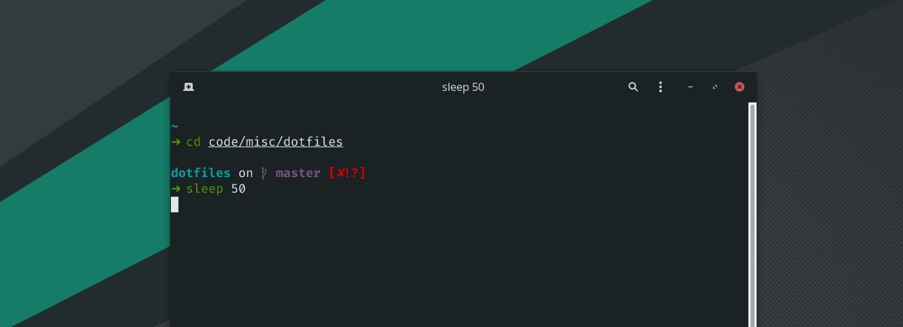

# dotfiles

Setup for my Mac (Apple Silicon, macOS 27) and the Ubuntu 26.04 x86_64 desktop I use from it over SSH. Setup stops on an Intel Mac, and warns on ARM Ubuntu, where a package with no ARM build fails its step.



## First run

Set up the Mac first: Ubuntu's **SSH key** manual step runs on the Mac.

### macOS

1. Clone the repo anywhere, such as `git clone https://github.com/gpahal/dotfiles ~/Dev/setup/dotfiles`. If `git` asks to install the Command Line Tools, install them and clone again.
2. Sign in to the App Store, so the `homebrew` step can install Amphetamine and Windows App. [Dato](https://apps.apple.com/app/dato/id1470584107) is paid and optional; buy it there first if you want it.
3. In the repo, run `bash setup.sh`. It sets up the [AI tools](./ai_tools/README.md) too.
4. Do the macOS [manual steps](#macos-1), starting with Ghostty's Full Disk Access.
5. Run the [checks](#check-it-works).

### Ubuntu

1. In the installer, choose TPM-backed disk encryption without a PIN ([guide](https://ubuntu.com/desktop/docs/en/latest/how-to/encrypt-your-disk-with-tpm/)), or none. A LUKS passphrase stops the machine booting unattended after a power cut.
2. At the machine, `sudo apt update && sudo apt install git`, then clone as on macOS.
3. Do the **BIOS/UEFI** [manual step](#ubuntu-2), and use Ethernet until setup prints the Wi-Fi commands.
4. At the machine, run `bash setup.sh`.
5. Do the rest of the Ubuntu [manual steps](#ubuntu-2).
6. Reboot once, so the T3 Code service and tmux get the `docker` group.
7. Run the [checks](#check-it-works) over SSH from the Mac.

## How setup works

`bash setup.sh` runs these steps in order. Each is `<step>/install.sh`, or `ai_tools/<step>/install.sh` for an [AI tool](./ai_tools/README.md), and also runs on its own:

| Step | What it does |
| :- | :- |
| `homebrew` | Installs [Homebrew](https://brew.sh/) and the [packages](#packages), after the apt packages it needs on Ubuntu |
| `runtimes` | Installs Node LTS and Go with mise, and Rust with rustup |
| `git` | Copies the git config and `git wt`, and offers a GitHub login with `gh` |
| `lazygit` | Copies the lazygit config |
| `ssh` | Makes `~/.ssh` private. On macOS, keeps keys in the keychain and loads them at login |
| `zsh` | Copies the zsh and starship config, hooks it into the startup files, imports your zsh history into atuin, records the [checkout](#where-the-repo-lives), and offers zsh as the login shell |
| `vim` | Copies the vim config and vim-plug, installs the plugins at their pins, and installs the Go tools vim-go uses |
| `tmux` | Copies the tmux config and `tmux-sessionizer`, and installs the pinned plugins. On Ubuntu, starts tmux at boot |
| `ghostty` | Copies the Ghostty config. On Ubuntu, installs the Ghostty snap and its terminfo, so SSH from Ghostty works |
| `zed` | Copies the Zed settings and keymap |
| `stream-deck` | Installs the [Stream Deck](#stream-deck) plugin and profiles, or on Ubuntu the daemon that drives the deck |
| `hammerspoon` | Copies the [Hammerspoon](#hammerspoon) config and the open-in script its hotkeys run. macOS only |
| `hotkeys` | Adds GNOME shortcuts that match [Hammerspoon](#hammerspoon)'s. Ubuntu only |
| `gnome` | Matches GNOME's keyboard, Files, and dock to the [macOS defaults](./macos/install.sh), and adds Quick Look. Ubuntu only |
| `vicinae` | Sets up the [Vicinae](#vicinae) launcher with the repo's shared settings, on `Cmd+Space` on macOS and `Super+Space` on Ubuntu, where it also installs it |
| `editorconfig` | Copies `~/.editorconfig` |
| `macos` | Sets [macOS defaults](./macos/install.sh), turns on the firewall, its stealth mode, and automatic App Store updates, frees `Cmd+Space` for Vicinae, and sets the hostname if needed. macOS only |
| `ubuntu` | Sets Ubuntu up for [running around the clock](#running-around-the-clock). Ubuntu only |
| `docker` | Installs Docker Engine. Ubuntu only; OrbStack provides Docker on macOS |
| `ntfy` | Runs a private [ntfy](#notifications) server on Ubuntu, published with Tailscale Funnel, and shows its messages as desktop notifications on both OSes |
| `chrome` | Installs Google Chrome from Google's apt repo, and removes Firefox. Ubuntu only |
| `logitech` | Installs Solaar from the Solaar team's PPA in place of Logi Options+, and gives the [MX Master 4](#mouse-and-keyboard) the Mac's settings and buttons. Ubuntu only |
| `monitor-input` | Installs ddcutil and the service that switches the [monitor's input](#monitor-input). Ubuntu only |
| `claude-code` | Installs [Claude Code](./ai_tools/README.md#claude-code) and sets both accounts' settings, status line, hooks, and instructions |
| `claude-desktop` | Installs the Claude [desktop app](./ai_tools/README.md#desktop-app), opens it at login, and sets its preferences |
| `codex` | Installs the [Codex](./ai_tools/README.md#codex) CLI, and sets its config and instructions |
| `t3-code` | Installs [T3 Code](./ai_tools/README.md#t3-code) and sets its settings. On Ubuntu, runs its server as a service |
| `skills` | Installs the repo's [skills](./ai_tools/README.md#skills) for Codex and Claude Code |
| `manual-steps` | Prints this OS's [manual steps](#manual-steps) that aren't done yet, the AI tools' last |

- `bash setup.sh git zsh` runs only those steps; `--help` lists them. A group's name runs its steps: `ai` runs the AI tools' steps and `manual-steps`, and `claude` runs `claude-code` and `claude-desktop`. Re-runs are safe. A failed step skips the steps that need it, and the run ends with the command that re-runs the failures.
- `--status [step...]` reports what's set up and changes nothing. Root-only checks run only while `sudo -v` is cached.
- Setup overwrites installed configs that differ from the repo's, with no backup, so run `just copy-back` first to keep edits. Files other tools also edit (shell startup files, `~/.ssh/config`, `~/.gitconfig`) only get setup's own lines added. A merge into an app's settings file, such as Vicinae's, offers a backup first, and `--backup` or `--no-backup` answers every such question.
- Settings that are yours, such as mise's global versions and the AI tools' models, are set when unset. When yours differs, setup asks before replacing it, and keeps it without a terminal.
- Installers are fetched over HTTPS without pinned checksums, as their vendors document. Apt keys must match pinned fingerprints.
- Run setup from a terminal such as Ghostty, not from T3 Code. On macOS, the AI tools' steps ask to quit T3 Code and the Claude app before merging their settings.
- `just status` runs `bash setup.sh --status`.

### Where the repo lives

The repo can live anywhere, and setup and `just` run from any clone or worktree. Two things run outside the repo, `upgrade` and the daily health check, so the `zsh` and `ubuntu` steps record the checkout they run from in `~/.local/state/dotfiles/checkout`. From a worktree, they record its main checkout, so removing the worktree doesn't break them. After moving the repo, re-run `bash setup.sh zsh ubuntu` (`zsh` on the Mac) from its new place. `--status` reports a stale record.

## Ubuntu

Run setup as your own user, not root. On Ubuntu Server, run `bash setup.sh` naming every step except `ghostty`, `zed`, `stream-deck`, `logitech`, and `chrome`, and install `upower` for UPS detection.

- Homebrew installs the Brewfile minus its `if OS.mac?` block, and the casks in `UBUNTU_CASKS` in [`homebrew/install.sh`](homebrew/install.sh). zsh comes from apt, Ghostty from its snap.
- Homebrew comes first on PATH, so its `python3`, `curl`, and `pkg-config` shadow the system's. Build against system libraries with `PATH=/usr/bin:/bin`.
- tmux and vim copy through OSC 52 to the Mac's clipboard.
- `gh` stores its token in `~/.config/gh/hosts.yml`, since the keyring is locked over SSH, and git uses HTTPS. To push `.github/workflows` changes, run `gh auth refresh -h github.com -s workflow --insecure-storage` once.
- Both machines' tmux use the `Ctrl+a` prefix, so press it twice for the inner one.

### Running around the clock

The `ubuntu`, `docker`, `ntfy`, and `chrome` steps keep the machine reachable:

- Suspend is off, and a kernel panic reboots after 10 seconds.
- With a USB UPS, the machine shuts down on low battery and starts when power returns.
- smartd, a daily health check, and each boot push alerts to your phone through the machine's own [ntfy server](#notifications). The health check reports on the [recorded checkout](#where-the-repo-lives), and alerts when it's gone.
- Security, Chrome, Docker, and ntfy updates install daily without rebooting.
- User services, such as the T3 Code server and tmux, start at boot without a login.
- sshd lets only you in, and turns off passwords once you've used a key. Use OpenSSH over the tailnet, not Tailscale SSH, which drops sessions when tailscaled restarts.
- You can run `tailscale serve` and `funnel` without `sudo`. `--status` flags any funnel but ntfy's, and Tailscale SSH being on.
- ufw lets SSH in only from private ranges, and lets the tailnet reach every port. The tailnet's access rules are what protect the machine, so keep them tight.
- Docker's published ports listen on `127.0.0.1` unless given an address. Joining the `docker` group is root-equivalent, so the step asks.
- Wired connections wake on LAN, with the BIOS setting on.
- Wi-Fi power save is off, so SSH over Wi-Fi doesn't lag.
- cloud-init is off outside a VM, since it only sets up a fresh install. cups-browsed is masked, so network printers aren't added by themselves; printing still works.

## What's included

### git

Config in [`git/`](git/), copied to `~/.config/git/`. Per-machine settings go in `~/.gitconfig` or `~/.gitconfig.local`, which git reads after this config. Signing setup and `gh` write to `~/.gitconfig`.

- `git dft`, `git dd`, `git dlog`: difftastic diffs.
- `git cob`, `git cobr`: pick a local or remote branch with fzf.
- `git wt` manages worktrees under `~/.worktrees`. `cd "$(git wt add <name> [<base>])"`; `git wt` alone prints usage.

#### Code layout

Projects live at `~/Dev/<group>/<project>`, such as `~/Dev/go/envl`. Worktrees go beside projects, not inside them:

| Tool | Worktrees |
| :- | :- |
| `git wt`, the `implement` skill, and Claude Code's `--worktree`, subagents, and background sessions | `~/.worktrees/<group>/<project>/<name>`, or `~/.worktrees/_/<project>-<hash>/<name>` outside `~/Dev/<group>/<project>` |
| T3 Code | `~/.t3/worktrees/<repo>/<worktree>` |
| The Codex app | `~/.codex/worktrees` |

#### Commit signing

`just git-signing` signs commits and tags with an SSH key and prints the `gh` commands that add it to GitHub. macOS uses `~/.ssh/id_ed25519` from the keychain; Ubuntu uses `~/.ssh/id_ed25519_signing`, with no passphrase, since agents can't type one.

### GitHub repos

`just github-repo [owner/repo]` lists each of a repo's settings that differs from the standard and changes them once you confirm. With no repo, it uses the one you're in. `--check` only reports, and exits 3 if anything differs. You need admin on the repo.

The standard:

- Issues are on. Projects, wiki, and discussions are off.
- Merges are squash only. A squash commit takes the PR's title and description. Auto-merge, the update branch button, and deleting merged branches are on.
- A `main` ruleset that nobody can bypass. Every change goes through a PR, which needs no approval, passing required status checks, and a squash merge. `main` keeps a linear history of signed commits, and nobody can force-push to it or delete it.
- Actions must be pinned to a commit SHA, and `GITHUB_TOKEN` is read-only by default. Actions can open and approve PRs. A PR from any outside contributor waits for your approval before its workflows run.
- Secret scanning is on, with push protection. So are Dependabot alerts and security updates, private vulnerability reporting, CodeQL default setup, and immutable releases.
- The repo has `.github/dependabot.yml`, a copy of [`github/dependabot.yml`](github/dependabot.yml), which bumps the pinned actions monthly after a week's cooldown. In a checkout of the repo, the recipe copies the file there for you to commit in a PR.

A private repo on GitHub Free can't have some of these, and the recipe lists them as `n/a` without counting them as differences:

- The ruleset and auto-merge, which need GitHub Pro, or Team for an org. Nothing stops a direct push or a force push to `main`.
- Secret scanning, push protection, and CodeQL, which need GitHub Secret Protection or Code Security.
- Private vulnerability reporting, which only public repos have.

A private repo's fork PRs run workflows only once you approve, with a read-only token and no secrets.

For the required status checks, the recipe offers the ruleset's current ones for you to edit. A repo without a ruleset gets the checks that ran on its latest PR instead. `--checks check,lint` sets them without asking, and `--checks none` requires none.

### SSH

`just ssh-host <alias> [hostname]` adds a `~/.ssh/config` block with keepalives and a shared connection. `ssh -O exit <alias>` closes it.

### vim

[`vim/vimrc`](vim/vimrc) with vim-plug, plugins pinned by commit. Leader is `Space`: `e` NERDTree, `f` files, `/` ripgrep, `b` buffers.

### zsh

[`zsh/`](zsh/), copied to `~/.zsh/`, with starship. The login shell is the system zsh, so it survives a broken Homebrew. Put secrets and per-machine settings in `~/.zshrc.local`.

- `Ctrl+T` files, `Alt+C` directories, `Ctrl+R` and Up search history (atuin).
- `g`, `c` (`bat`), `t` (`eza --tree`), `port`, `killport`, `o`, `scratch`, `reload`, `zshrc` (edits `~/.zshrc`), `ts` (`tmux-sessionizer`).
- `rm` deletes immediately. On macOS, `trash` can be undone.

### Ghostty

[`ghostty/`](ghostty/). `` Cmd+` `` toggles the quick terminal (needs Accessibility). `Cmd+Shift+S` opens the screen's text in TextEdit.

#### Ghostty notifications

Claude Code and Codex notify through Ghostty, inside tmux too. Outside tmux, Ghostty also notifies when a command of 10 seconds or more finishes in an unfocused window. To allow the notifications:

1. Run `scripts/test-notification.sh` from the repo in Ghostty and click **Allow**. In **System Settings → Notifications → Ghostty**, allow notifications with the **Persistent** style.
2. Add Ghostty to any Focus mode's **Allowed Apps**.

### Zed

[`zed/`](zed/). AI features and telemetry are off, and so is its updater, so `upgrade` updates it. The window title ends with the file's path, which Stream Deck and Hammerspoon read.

### Stream Deck

The **Dotfiles** keys act on the folder of the app in front: a Ghostty tab's, a Zed file's, the file manager's, a T3 Code thread's, or a Code session's in the Claude app. The [Hammerspoon](#hammerspoon) hotkeys use the same folder.

- **Overview**, labeled MAC or UBUNTU for the machine it runs on, shows CPU and memory, and on the 15-key model opens the **System** page of stats. **Back** there returns to the main page.
- **Mic** names the mic in use, green while live and red and crossed out while muted, with a dot for each mic. A press switches to the next mic, and holding the key for half a second mutes or unmutes it. It skips apps' virtual mics, such as Zoom's. On the Mac, muting sets the mic's input volume to 0, and unmuting restores the volume it had.
- **Sound**, in the top row, names the sound output in use at its top, with a dot for each output it can switch to. A press switches to the next of the speakers, headphones, monitor, and Mac's speakers that's connected. It skips other outputs, such as an app's virtual device; `OUTPUTS` in [`sound.js`](stream-deck/com.gpahal.dotfiles.sdPlugin/sound.js) lists the ones it knows. On the Mac it needs switchaudio-osx, from the Brewfile, as **Mic** does.
- **Upgrade** runs `upgrade` in a new Ghostty tab.
- **Editor** opens Zed at that folder, or a new window when there's none.
- **Terminal** brings Ghostty's tab at that folder to the front, else opens a tab there. With no folder, it brings Ghostty to the front. With Ghostty in front, it opens another tab at the same folder. A tab goes in Ghostty's window, and a window opens only when Ghostty has none.
- **Files** opens the file manager at that folder, or a new window when there's none.
- **T3 Code**, **Claude**, **Chrome**, **New Tab**, **Gmail**, and **Agenda** match the Hammerspoon hotkeys.
- **Gmail**, **Notion**, and **Agenda** focus or open Gmail, [Notion](https://app.notion.com/), and [the agenda](https://garvitpahal.com/x/agenda).

[`layout.json`](stream-deck/com.gpahal.dotfiles.sdPlugin/layout.json) places the keys of both pages on both OSes. [`stream-deck/icons`](stream-deck/icons/README.md) lists the app icons' sources.

On macOS, a plugin adds the keys to Elgato's Stream Deck app, with a read-only profile for each page. Stream Deck shows the main page when it starts and when the deck comes back from Ubuntu, and setup deletes any other profile for the deck. The file manager's folder is Finder's selection. T3 Code's and Claude's come from the thread or session their page shows; when the page can't be read, the window's title picks it, else the one used last.

Elgato's app doesn't run on Linux. On Ubuntu, the `dotfiles-stream-deck` user service draws the same keys, and a GNOME extension lets it read and focus windows. Unlike on macOS:

- The file manager's folder is its window's, not its selected file. T3 Code's and Claude's come from the thread or session the window's title names, else the one used last.
- **Gmail**, **Notion**, and **Agenda** open in their own Chrome windows, and the stat keys open Resources.
- **Power** shows the CPU package, its cores, and the GPU, with no figure for the whole machine.
- Keys that open apps do nothing while the screen is locked.
- Only the 15-key model works. The daemon leaves other decks blank and logs why.
- The deck's brightness is 60%, set each time it connects.
- `journalctl --user -u dotfiles-stream-deck` shows its log.

### Hammerspoon

macOS only. Hotkeys on `Ctrl+Opt+Cmd` (Rectangle takes `Ctrl+Opt`):

- `Space` Claude, `B` Chrome, `C` T3 Code.
- `T` Ghostty and `E` Zed, at the folder in front, as the Stream Deck's **Terminal** and **Editor** keys.
- `N` a new Chrome tab, with the clipboard's text pasted and selected.
- `A` the agenda and `M` Gmail, as the Stream Deck's keys open them.

On Ubuntu, the `hotkeys` step adds the same shortcuts on `Ctrl+Alt+Super`, which run the [Stream Deck](#stream-deck)'s actions. A shortcut of yours on the same keys keeps them, and `--status` names it. `journalctl --user -t dotfiles-hotkeys` shows their log.

### GNOME

Ubuntu only. The `gnome` step sets what the `macos` step sets in Finder, the Dock, and the keyboard, where GNOME has a match:

- Keys repeat after 225 ms, then every 30 ms.
- Files shows hidden files and opens folders in list view. File choosers show hidden files too.
- The dock sits on the left and hides until the pointer reaches the screen's left edge.
- Space in Files previews the selected file, as Quick Look does (gnome-sushi).

### Vicinae

[Vicinae](https://docs.vicinae.com/) launches apps, keeps clipboard history, and runs many Raycast extensions. `Cmd+Space` opens it on the Mac, and `Super+Space` on Ubuntu.

- Both machines share [`vicinae/dotfiles.json`](vicinae/dotfiles.json): favorites, fallbacks, keybindings, theme, font, window size, and extension settings, with telemetry off. The step copies it to `~/.config/vicinae/` and adds it to the `imports` in `~/.config/vicinae/settings.json`.
- Vicinae's settings window saves to `settings.json`, whose values win over the shared file. `--status` names each shared setting that `settings.json` overrides. To share a change, move it to `vicinae/dotfiles.json` and delete it from `settings.json`.
- On the Mac, the homebrew step installs it and `upgrade` updates it. Paste into the active window and snippets are on, and need the Accessibility permission.
- On Ubuntu, Vicinae's installer puts it in `~/.local`, without sudo, and `upgrade` moves it to the latest release. Paste into the active window and snippets are off, since they need root. Pick a clipboard entry to copy it, then press `Ctrl+V`.
- Its GNOME extension, from extensions.gnome.org, gives it the clipboard and the window list. GNOME loads it at the next login.
- `Super+Space` doesn't switch keyboard layouts. With more than one layout, `Shift+Super+Space` still does.
- A shortcut of yours on `Super+Space` keeps it, and `--status` names it. `journalctl --user -u vicinae` shows Vicinae's log on Ubuntu.

### Monitor input

A USB switch moves the keyboard, mouse, and Stream Deck between the Mac and the Ubuntu desktop, and the monitor's input follows them over DDC/CI. Each machine switches the monitor to itself when the devices arrive. Ubuntu also hands the monitor back to the Mac when the devices leave it, so switching works while the Mac sleeps.

1. Pick a device the switch moves, such as the keyboard's receiver. `just monitor-input` lists the attached devices' `vendor:product` IDs, and the common input codes.
2. On the Mac: `just monitor-input <vendor:product> <Mac's input>`, such as `just monitor-input 1234:5678 27` for USB-C.
3. On Ubuntu: `just monitor-input <vendor:product> <Ubuntu's input> <Mac's input>`, such as `just monitor-input 1234:5678 17 27` for HDMI 1. With more than one monitor connected, add the output, such as `HDMI-A-1`.
4. In the monitor's menu, turn off its automatic input selection, so it wakes from sleep on the input it showed rather than the one it prefers. Some monitors have a separate setting for USB-C, which needs turning off too.

`just monitor-input off` turns it off on that machine. Ubuntu logs each switch to `journalctl -u dotfiles-monitor-input`, and the Mac shows failures in Hammerspoon's console.

### Monitor volume

macOS can't set the volume of HDMI or DisplayPort audio, so while the monitor is the Mac's sound output, Hammerspoon has the volume keys set the monitor's own volume over DDC/CI with m1ddc, from the Brewfile. Mute sets the monitor's volume to 0 and unmute brings it back, and `Shift+Opt` makes finer steps. Other outputs, such as headphones, keep the usual keys. The monitor answers only while it shows the Mac, and only with DDC/CI on in its menu.

Ubuntu sets the volume of HDMI audio itself, so its volume keys work as usual.

Speakers on the monitor's audio line-out may not follow the monitor's volume, so the Mac's keys don't reach them. Ubuntu's keys still do. USB speakers on the USB switch work with both machines. They follow the keyboard, and the machine they're on sets their volume itself.

### Mouse and keyboard

**MX Master 4.** Logi Options+ sets the mouse up on the Mac, and Solaar on Ubuntu. [`logitech/mx-master-4.yaml`](logitech/mx-master-4.yaml) holds its settings in Solaar's terms, each beside the Options+ setting it matches, and the `logitech` step gives them to Solaar. Change a setting there and in Options+ together.

- Solaar sets the DPI, scroll direction, SmartShift, thumb wheel, and haptic feedback from it. Options+ uses its own scale for pointer speed, SmartShift sensitivity, and the haptic sense panel's force, so the file gives the Options+ values beside Solaar's.
- The gesture button works as in Options+'s Window navigation. A click, or holding it and moving up, opens the Activities overview. Moving down opens the app grid, and left or right switches workspaces.
- The Actions Ring button opens the app grid, since the Actions Ring is Options+ only.
- Solaar writes over its settings file while it runs, so the step doesn't write the settings then and tells you. Quit Solaar from its menu, re-run `bash setup.sh logitech`, and open Solaar again.
- The buttons' actions are in [`logitech/solaar-rules.yaml`](logitech/solaar-rules.yaml). The step replaces Solaar's `~/.config/solaar/rules.yaml` with it, so add rules there, not in Solaar's rule editor.

**NuPhy Air75 V3.** The keyboard stores its keymap, macros, and lighting itself, so it works the same on both machines. [`nuphy/`](nuphy/) keeps a copy of its Mac mode, its Windows mode, and its macro (`Cmd+Ctrl+Shift+4` on the Mac mode's screenshot key), exported from [NuPhy IO](https://drive.nuphy.io).

- `just keyboard` loads the copy onto a new or reset keyboard. NuPhy IO runs only in Chrome, which has you pick the keyboard, so the script opens it and walks you through each import, with the file's path on the clipboard for the file dialog. Plug in the keyboard's cable or its 2.4G receiver first, since NuPhy IO can't reach it over Bluetooth.
- After a change in NuPhy IO, `just keyboard export` walks you through exporting the modes and the macro, then moves Chrome's downloads into `nuphy/` under the repo's names. Commit them.
- Keep the files as NuPhy IO wrote them: it checks each one against the hashes inside it.

### Notifications

Ubuntu runs a private [ntfy](https://ntfy.sh) server. Tailscale Funnel publishes it at `https://<machine>.<tailnet>.ts.net:8443`, the machine's one port open to the internet. Nobody without your password or a token can read or send. The server keeps messages for 72 hours, so a device that was offline catches up.

- **Topics.** `alerts` gets the disk, UPS, health, and boot alerts, and `agenda` is for your web service. Any other topic works too.
- **Users.** You sign in with a password in the Android app and the web app. The `machine` user reads and sends on every topic, with a token for each place that uses it: `desktop`, `macbook`, and `web-service`.
- **Desktop notifications.** The Mac and Ubuntu show `alerts` and `agenda` as notifications, and catch up on what arrived while they were asleep or off. Ubuntu stacks them under one **ntfy** entry, which you can expand, or clear in one click. They stay until you dismiss them, even across a restart. Their settings are in **Settings → Notifications → ntfy**. The Mac stacks them under terminal-notifier, unless **Notification grouping** is off in **System Settings → Notifications → terminal-notifier**. Clicking one opens its `Click` link, as on the phone; an `agenda` notification without one opens [the agenda](https://garvitpahal.com/x/agenda). Ubuntu also shows a button for each `view` action, which the Mac leaves out. Only the Android app runs `http` and `broadcast` actions.
- **Repeats replace each other.** A message with a sequence ID replaces the notification of the last one with that ID, on the desktops and the phone. The alerts use this. A health alert or the all-clear replaces the last health alert, and a boot notice replaces the last boot notice. A UPS event replaces the last one of its kind, so "UPS on mains power" replaces "UPS on battery". A SMART warning replaces the last one of the same kind for that disk.
- **Alert actions.** Clicking a disk, UPS, or health alert on the Mac or Ubuntu opens a Ghostty tab with the command that shows what's wrong and how to fix it. The command runs when you press Enter, on the desktop: directly there, or over `ssh` from the Mac. The first time, macOS asks to let terminal-notifier control Ghostty. The phone shows the alert's `action:` tag as text.
- **Restarts and updates.** The server starts at boot, and the funnel comes back with Tailscale. The notifier starts when you log in: on Ubuntu with the desktop session, on the Mac as a login item under **Allow in the Background** in **System Settings → General → Login Items & Extensions**. The daily security updates install new ntfy versions on Ubuntu and restart the server. `upgrade` updates ntfy on both machines and restarts the notifiers.
- **Alerts only go to this server.** Until `just ntfy-user` sets them up, the alerts fail and log why (`journalctl -t dotfiles-smartd`, `journalctl --user -u dotfiles-health`), and `--status` reports it. They never send to ntfy.sh, even with an older ntfy.sh URL saved; `just alerts` replaces it.
- **Sending.** `ntfy publish alerts "Backup done"` works on both machines. From anywhere else, such as your web service:

  ```sh
  curl -H "Authorization: Bearer <token>" -H "Title: Standup" -d "In 10 minutes" \
      -H "Click: https://garvitpahal.com/x/agenda/<event>" \
      -H "Actions: view, Join call, https://meet.example.com/<id>" \
      https://<machine>.<tailnet>.ts.net:8443/agenda
  ```

  `Priority` and `Tags` headers set the priority and the icons. A tag `action:<name>` gives a desktop notification an action from [`ntfy/actions.sh`](ntfy/actions.sh), the only commands a click can run: a bare name runs on the computer showing it, and `linux-<name>` or `mac-<name>` on that machine. `Click` sets the link a click opens, and `Actions` adds up to three buttons, separated by `;`: `view, <label>, <url>` opens a page, and `http, <label>, <url>` sends a request from the phone. `X-Sequence-ID: <id>`, in letters, digits, `-`, and `_`, replaces the notification of the topic's last message with that ID, such as an event's earlier reminder. `At: tomorrow, 9am` or `Delay: 30m` sends it later, up to 3 days ahead. To read a topic's last 72 hours, send `GET /agenda/json?poll=1&since=72h` with the same header.
- **Tokens.** `just ntfy-user` prints the `macbook` and `web-service` tokens again. `just ntfy-user --rotate <label>` replaces one, and the old one stops working.
- **Password.** ntfy keeps only its hash, so it can't be shown again. `just ntfy-user --change-pass` sets a new one and signs out the web app; then change it in the Android app too.
- **After a lost disk.** ntfy's data isn't backed up. Run setup, then `just ntfy-user`, which makes new tokens; you can reuse your password. Then run `just ntfy-device` on the Mac with the new `macbook` token, give your web service its new token, and re-enter your password in the Android app.
- **Funnels.** Never run `tailscale serve reset` or `tailscale funnel reset`, which also remove T3 Code's serve. Turn off one port with `tailscale funnel --https=<port> off`.

### tmux

Prefix `Ctrl+a`. `|` and `-` split, `hjkl` move, `HJKL` resize, `Ctrl+h` and `Ctrl+l` switch windows, `v` copy mode, `S` new session, `X` kill session, `f` `tmux-sessionizer`. vim-tmux-navigator takes `Ctrl+hjkl`, so clear the screen with `prefix+Ctrl+k`.

### Packages

The CLI tools are in [`homebrew/Brewfile`](homebrew/Brewfile), and the macOS apps in `CASKS` and `MAS_APPS` in [`homebrew/install.sh`](homebrew/install.sh).

### Touch ID for sudo

`just touch-id` makes `sudo` take Touch ID, inside tmux too. It writes `/etc/pam.d/sudo_local` whole, replacing any lines you added. Re-run it after `brew upgrade` updates pam-reattach; `--status` says when. If `sudo` breaks, remove the file with an admin password, then re-run it:

```sh
osascript -e 'do shell script "rm /etc/pam.d/sudo_local" with administrator privileges'
```

## Manual steps

`bash setup.sh manual-steps` prints the ones here that aren't done, leaving out each it can check is done, and `bash setup.sh --status manual-steps` reports those checks. The AI tools' steps come last on each OS; [ai_tools/README.md](./ai_tools/README.md#manual-steps) also lists them on their own.

### macOS

**Permissions**

1. Give Ghostty Full Disk Access in **System Settings → Privacy & Security → Full Disk Access**, reopen it, and run `bash setup.sh macos` in the repo again. Do the rest from Ghostty.
2. Allow Ghostty's notifications, with step 1 of [Ghostty notifications](#ghostty-notifications).
3. Add Ghostty to any Focus mode's **Allowed Apps**.
4. Add Ghostty in **System Settings → Privacy & Security → Accessibility**.

**Apps**

5. Set Google Chrome as the default browser.
6. Open Logi Options+, grant its permissions, and pair your devices.
7. Open OrbStack once and finish its setup.
8. Open Vicinae and finish its onboarding. Grant Accessibility, which paste and snippets need, and keep Launch at login on. Full Disk Access is optional; file search needs it to cover every folder.
9. Open Rectangle, grant accessibility, and set your shortcuts.
10. Open Wispr Flow, sign in, and finish its onboarding. Grant Microphone and Accessibility, which typing into other apps needs.
11. Turn on Launch at login in Rectangle, Amphetamine, Tailscale, and Dato.
12. Optional: turn on AppCleaner's SmartDelete, and install [Supercharge](https://sindresorhus.gumroad.com/l/supercharge).
13. Open Stream Deck and accept its prompt to install the **Main** profile. Press **Overview** and accept the prompt for the **System** profile. Press **Editor**, **Terminal**, and **Files** with Ghostty, Zed, and Finder in front, then **New Tab** and **Gmail**, and **Allow** each prompt. Add Elgato Stream Deck in **Privacy & Security → Accessibility**.
14. Open Hammerspoon and add it in **Privacy & Security → Accessibility**. Press `Ctrl+Opt+Cmd+T` and `E` with Ghostty, Zed, and Finder in front, then `N`, and **Allow** each prompt.
15. Optional: set up [monitor input](#monitor-input) switching on the Mac and on Ubuntu.

**Accounts and keys**

16. Sign in to Tailscale with the account your Ubuntu machine and phone use.
17. Run `just ntfy-device` and paste the `macbook` token that `just ntfy-user` printed on Ubuntu.
18. Run `ntfy publish alerts test` on Ubuntu. When macOS asks, allow terminal-notifier's notifications. Choose the **Persistent** style if alerts should stay until you dismiss them.
19. Add your Google account to Calendar and Contacts.
20. In Chrome, sign in to the sites you want agents to use.
21. If you skipped the GitHub login, re-run `bash setup.sh git` from a terminal and accept it.
22. Run `just git-signing` and the `gh` commands it prints.

**Security and backups**

23. Optional: `just touch-id`.
24. Turn on FileVault.
25. Back up off the Mac, such as with Time Machine.
26. Restore a file from the backup once, to check it.

**Performance and privacy**

27. In **System Settings → Spotlight → Search Privacy…**, add `~/Dev`, `~/go`, and `~/Library/pnpm`, so Spotlight stops indexing builds and package stores. Press `Cmd+Shift+G` in the file picker to type a path.
28. In **System Settings → Spotlight**, turn off the clipboard history, or keep it for the shortest time offered. It keeps copied passwords.
29. Optional: if you don't use Apple Intelligence, turn it off. Search System Settings for **Apple Intelligence**.
30. In Chrome, turn on **Memory Saver** in `chrome://settings/performance`.

**AI tools**

31. **Logins.**
    - Run `claude-main auth login`, then `claude-backup auth login`, signing in with the backup account. `claude-use` picks the one that `claude` and new T3 Code threads use; see [Two accounts](./ai_tools/README.md#two-accounts).
    - Sign in to the Claude app, and open T3 Code once.
    - Run `codex login`.
32. **Notifications.** In **System Settings → Notifications**, allow notifications with the **Persistent** style for:
    - Claude and T3 Code. `manual-steps` opens the ones it can tell aren't set.
    - Any terminal other than Ghostty.
33. **Claude in Chrome.** See [Browser (Claude in Chrome)](./ai_tools/README.md#browser-claude-in-chrome).
34. **Claude Code computer use.** Per project, see [Computer use](./ai_tools/README.md#computer-use).
35. **T3 Code phone app.** See [Mobile](./ai_tools/README.md#mobile).
36. **Claude phone app.** Install it, sign in, and allow notifications.
37. **Training opt-outs.** See [Privacy](./ai_tools/README.md#privacy).
38. **GitHub repositories.** Enable **Allow squash merging** in each, and **Allow auto-merge** if you use it.

### Ubuntu

Once:

1. **BIOS/UEFI.** Set the power-loss setting to **Power On**. For Wake-on-LAN, turn it on and turn **ErP**/**EuP** off.
2. **Network.** Use Ethernet, or run the `nmcli` commands the `ubuntu` step prints so Wi-Fi connects at boot.
3. **Disk encryption.** Store the recovery key off the machine.
4. **Login shell.** `chsh -s /usr/bin/zsh`, if you skipped it.
5. **Tailscale.**
   - Run `sudo tailscale up`.
   - In the admin console, disable key expiry for the machine.
   - In the admin console's **DNS** page, turn on MagicDNS and **HTTPS Certificates**, which ntfy's Funnel needs.
   - Limit the access policy, and remove `root` from `users` in its `ssh` rules.
   - Keep the `funnel` nodeAttr for this machine in the access policy. The `ntfy` step publishes ntfy with it.
6. **SSH key.** On the Mac:
   1. `ssh-keygen -t ed25519`, if there's no `~/.ssh/id_ed25519`.
   2. `just ssh-host <alias> <machine-name>`, using the machine's name in Tailscale. Leave out `<machine-name>` if it matches the alias. With MagicDNS off, use the full `<machine-name>.<tailnet>.ts.net` name.
   3. `ssh-copy-id <alias>`.
   4. `ssh -O exit <alias>`.

   Then SSH in with the key and re-run `bash setup.sh ubuntu`, which turns off password logins and finishes the Tailscale setup. Before closing that session, check `ssh -S none <alias> true` from the Mac.
7. **GitHub.** If you skipped the login, re-run `bash setup.sh git` from a terminal and accept it.
8. **Commit signing.** Run `just git-signing` and the `gh` commands it prints.
9. **Logitech.** At the desktop, open Solaar and pair your devices.
10. **GNOME extensions.** Log out of the desktop and back in once, so GNOME loads the extensions the `stream-deck` and `vicinae` steps turned on.
11. **Monitor input (optional).** Set up [monitor input](#monitor-input) switching here and on the Mac.
12. **Desktop session after a reboot.** Solaar and Claude in Chrome need one. Turn on Remote Login in **Settings → System → Remote Desktop** and connect over Tailscale with Windows App, or turn on GDM automatic login (the keyring stays locked).
13. **ntfy.** Run `just ntfy-user`. Choose a password for the Android app and the web app. Keep it, and the two tokens the script prints, in your password manager.
14. **Phone.** Install the ntfy app on Android. In **Settings → Manage users**, add your user and password for `https://<machine>.<tailnet>.ts.net:8443`, port included. Set the same URL as **Settings → Default server**. Then, for `alerts` and `agenda`, tap **+**, enter the topic, and tap **Subscribe**. Allow the app's permanent notification, turn off battery optimization for it, and run `just alerts test`. Unsubscribe from any old ntfy.sh topic.
15. **ntfy from the internet.** On the phone, with Tailscale off and on mobile data, open `https://<machine>.<tailnet>.ts.net:8443/v1/health`. It shows `{"healthy":true}` within about 10 minutes of the first `bash setup.sh ntfy`.
16. **Web service (optional).** Give your web service the server's URL and the `web-service` token, then send a test. [Notifications](#notifications) shows how.
17. **Power cuts.** Plug in the UPS over USB and re-run `bash setup.sh ubuntu`. Then:
    1. Unplug the UPS from the wall and wait for the push, the shutdown, and the UPS cutting its output (`sudo upsmon -c fsd` shuts down at once). If the output stays on, find the UPS setting that cuts it on shutdown.
    2. Plug it back in, and check the machine starts and `just status` shows the UPS on mains.
    3. At the machine, `sudo rtcwake -m off -s 120` starts it 2 minutes later. If it doesn't, only the BIOS setting brings it back.
    4. Run `just alerts test` again.
18. **Backups.** Back up `~` and `/var/lib/docker/volumes` off the machine on a schedule, such as with Déjà Dup.
19. **Restore.** Restore a few files from the backup once, to check it.
20. **Livepatch (optional).** `sudo pro attach <token>`, then `sudo pro enable livepatch`.
21. **Display scale.** In **Settings → Displays**, set **Scale** to **167%**, between 150% and 200%.

**AI tools.** Over SSH, logins print a link to open on the Mac.

22. **Sudo work.** If setup ran without a terminal, run `bash setup.sh claude-desktop codex t3-code` from one.
23. **Claude Code.** `claude-main auth login`, then `claude-backup auth login`, signing in with the backup account.
24. **Codex.** Turn on device code login in ChatGPT's **Settings → Security**, then `codex login --device-auth`.
25. **Claude in Chrome.** At the desktop, see [Browser (Claude in Chrome)](./ai_tools/README.md#browser-claude-in-chrome).
26. **T3 Code.** Connect to the [service](./ai_tools/README.md#t3-code-on-ubuntu):
    - `t3 connect --headless` (open the link on the Mac), `t3 connect publish`, then `t3 service restart`.
    - On the phone, steps 3 to 5 of [Mobile](./ai_tools/README.md#mobile).
    - Run `t3 pair --tailscale` and paste the link in T3 Code on the Mac (**Settings → Connections → Add environment**). Don't use T3 Code's SSH connection type, which can start a second server.
    - After an agent first opens T3 Code's browser, re-run `bash setup.sh t3-code`. If it says the browser needs root, check `~/.local/bin/t3` is yours, then `sudo ~/.local/bin/t3 browser setup`.
    - At the desktop, run `t3 pair` and paste the link in the T3 Code app (**Settings → Connections → Add environment**).
27. **Claude app.** At the desktop, open Claude and sign in.

When needed:

- Reboot when `just status` says one is pending.
- Install firmware updates it lists: `fwupdmgr refresh && fwupdmgr update`.
- If `fwupdmgr refresh` times out, run `curl -sSI --max-time 15 https://cdn.fwupd.org/downloads/firmware.xml.zst.jcat` and `curl -sSI --max-time 15 https://fwupd.org`. When only the first fails, your network blocks the firmware CDN. Refresh on another network, such as a phone hotspot, or through a Tailscale exit node.
- After a release upgrade, re-run `bash setup.sh`.

## Check it works

The AI tools have their own [checks](./ai_tools/README.md#check-it-works).

### macOS

- `just status` prints no **Needs attention** line.
- In a new Ghostty window, `command -v brew mise node` prints three paths.
- In a scratch repo, `git commit --allow-empty -m test && git log --show-signature -1` shows `Good "git" signature`, also after a reboot without a passphrase prompt.
- After `just touch-id`, `sudo -k && sudo -v` asks for Touch ID, in tmux too.
- With a file open in Zed, the Stream Deck **Terminal** key opens Ghostty at its folder.
- `Cmd+Space` opens Vicinae, and `Cmd+Space` again closes it.
- After `just ntfy-device`, `ntfy publish alerts test` on Ubuntu shows a notification on the Mac.

### Ubuntu

Over SSH from the Mac:

- `sudo -v && just status` prints no **Needs attention** line.
- `command -v brew mise node` prints three paths, and a test commit is signed.
- After a reboot, `ssh <alias>` connects, `docker ps` works without `sudo`, `tmux ls` lists the old sessions, and the phone gets the boot notice.
- `curl -s http://127.0.0.1:2586/v1/health` prints `{"healthy":true}`, and `ntfy publish alerts test` reaches the phone.
- `iw dev <device> get power_save` prints `Power save: off` for the Wi-Fi device `nmcli device` lists, also after a reboot.
- `systemctl is-enabled cups-browsed` prints `masked`, and `cloud-init status` prints `status: disabled` after a reboot.
- `snap list firefox` and `dpkg -s firefox` both say Firefox isn't installed, and `xdg-settings get default-web-browser` prints `google-chrome.desktop`.
- `fwupdmgr refresh --force` finishes without a timeout. If it times out, see **When needed** in the [manual steps](#ubuntu-2).

At the desktop, with the Stream Deck switched to it:

- The keys show, and **Overview** opens the **System** page.
- With a file open in Zed, **Terminal** and `Ctrl+Alt+Super+T` open Ghostty at its folder.
- `Super+Space` opens Vicinae. Typing an app's name and pressing `Enter` opens the app, and `Super+Space` again closes Vicinae.
- Copy two bits of text, open **Clipboard History** in Vicinae, and pick the first. `Ctrl+V` in a text field then pastes it.
- Holding a key in a text field repeats it after about a quarter of a second.
- Files lists folders in list view and shows hidden files, such as `.config` in your home folder. Selecting a file and pressing `Space` previews it, and `Space` again closes the preview.
- The dock stays hidden until the pointer reaches the screen's left edge, also with no window open.
- After the **Display scale** manual step, **Settings → Displays** shows **Scale** at **167%**.

## Updating

`upgrade` runs [`scripts/upgrade.sh`](scripts/upgrade.sh) from the dotfiles checkout or worktree you're in, else the [recorded checkout](#where-the-repo-lives). `just upgrade` uses the checkout that holds the justfile. Either updates apt, Homebrew, App Store apps, vim and tmux plugins to their pins, Vicinae and its GNOME extension, mise tools, global npm packages, uv tools, Rust, and the AI tools (`upgrade-ai-tools`, see [ai_tools/README.md](./ai_tools/README.md#updating)), and restarts ntfy's notifier on the new version. It lists failed stages and returns 1.

It updates every app Homebrew installed, including the ones that update themselves. On the Mac, it quits a running app, updates it, and opens it again in the background. Chrome reopens with its **On startup** setting, so set it to **Continue where you left off** to keep your tabs, and OrbStack stops its containers and machines while it restarts. Ghostty, likely the terminal `upgrade` runs in, is never quit, and neither is an app that doesn't quit within 20 seconds, such as one asking to save: `upgrade` names those in one line, such as `Running, so not updated: Ghostty.`, so quit them and run it again. The AI tools' apps update only when closed, since T3 Code may be running the session you're in.

- Install global npm CLIs with `mise use -g npm:<package>`, since mise removes old Node versions with their `npm install -g` packages.
- Don't run `brew bundle cleanup`: the Brewfile lists no casks, so it uninstalls them all.
- To update configs, pull and re-run `bash setup.sh`.

## Maintenance

- `just copy-back [dry-run]` copies installed configs that differ back into the repo for review with `git diff`. It skips repo files with uncommitted changes.
- `just clean-caches` lists build and download caches with their sizes: Go's build cache, the pnpm store, npm's cache, Homebrew's downloads, Playwright's browsers, and PyTorch's downloads. Once you confirm, it clears them; `dry-run` stops after the list. pnpm keeps the packages your projects use. Each cache refills on next use.
- Add hand-installed packages to `homebrew/Brewfile`, or to `CASKS`, `MAS_APPS`, or `UBUNTU_CASKS` in `homebrew/install.sh`.
- `just bump-plugins` moves the vim and tmux plugin pins and vim-plug to their latest versions. Commit, then re-run `bash setup.sh vim tmux` on each machine.
- To change the Stream Deck's keys, edit `stream-deck/com.gpahal.dotfiles.sdPlugin/layout.json`, run `bash stream-deck/build-profile.sh`, and commit both. Then re-run `bash setup.sh stream-deck` on each machine. On the Mac, accept Stream Deck's prompt for each changed profile, pressing **Overview** for the **System** profile.
- To update the Ubuntu Stream Deck's packages, run `pnpm update` in `stream-deck/linux`, commit `pnpm-lock.yaml`, and re-run `bash setup.sh stream-deck`.
- The manual steps live in `manual-steps/steps.sh` and `ai_tools/manual-steps/steps.sh`, each with the check that tells it's done. After editing one, run `just manual-steps-doc`, which rewrites the READMEs' Manual steps lists.
- [AGENTS.md](./AGENTS.md) covers adding steps, `just check`, and `just test`.

## License

[MIT](LICENSE).
