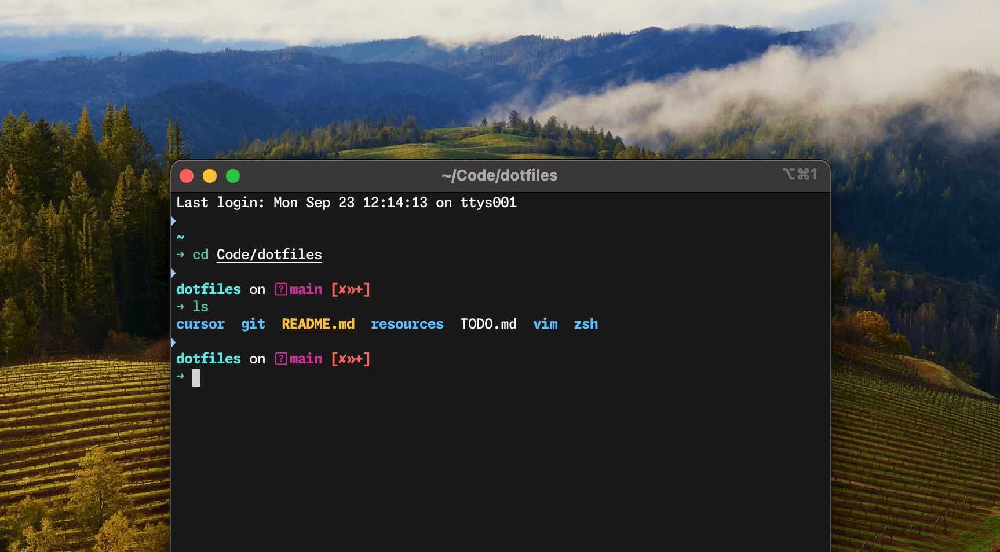

# dotfiles

A set of configuration files to setup my system. These should work on Linux and MacOS.



## Installation

### git

- Install [git](https://git-scm.com/book/en/v2/Getting-Started-Installing-Git) (might be pre-installed)
- Copy config files:

```sh
cp git/.gitconfig ~/.gitconfig
```

### zsh

- Install the following:
  - [zsh](https://github.com/robbyrussell/oh-my-zsh/wiki/Installing-ZSH)
  - [nerd-fonts](https://www.nerdfonts.com/)
  - [starship](https://starship.rs/)
  - [zsh-syntax-highlighting](https://github.com/zsh-users/zsh-syntax-highlighting/blob/master/INSTALL.md#oh-my-zsh)
  - [zsh-autosuggestions](https://github.com/zsh-users/zsh-autosuggestions/blob/master/INSTALL.md#oh-my-zsh)
  - [fzf](https://github.com/junegunn/fzf)
- Set zsh as your login shell:

```sh
chsh -s $(which zsh)
```

- Copy config files:

```sh
mkdir -p ~/.config
cp -r zsh/config/* ~/.config/
```

- Copy zsh files

```sh
mkdir -p ~/.zsh
cp -r zsh/*.zsh ~/.zsh/
```

- Add this line at the top of `~/.zshrc`

```sh
# Load main.zsh
source $HOME/.zsh/main.zsh
```

### vim

- Install [vim](https://www.vim.org/) (might be pre-installed)
- Copy config files:

```sh
cp vim/.vimrc ~/.vimrc
```

- When a new file is opened for the first time after updating `~/.vimrc`,
  [vim-plug](https://github.com/junegunn/vim-plug) is installed for managing vim plugins.

## Useful applications

- [tmux](https://github.com/tmux/tmux): a terminal multiplexer
- [ripgrep](https://github.com/BurntSushi/ripgrep): recursively searches directories for a regex
  pattern
- [fd](https://github.com/sharkdp/fd): a simple, fast and user-friendly alternative to 'find'
- [fasd](https://github.com/clvv/fasd): a command-line productivity booster
- [bat](https://github.com/sharkdp/bat): cat(1) clone with wings
- [broot](https://github.com/Canop/broot): a new way to navigate directory trees

## Configuation

### Appearance

- Display fonts - [Noto Fonts](https://www.google.com/get/noto/)
- Monospace fonts - [Nerd Fonts](https://www.nerdfonts.com/) - FiraMono Nerd Font
- One dark theme
  - [JetBrains](https://plugins.jetbrains.com/plugin/11938-one-dark-theme)
  - [VS Code](https://marketplace.visualstudio.com/items?itemName=zhuangtongfa.Material-theme)
  - [Gnome terminal](https://github.com/denysdovhan/one-gnome-terminal)
- [Wallpaper - A Journey](https://www.deviantart.com/asthi21/art/A-Journey-873092128)

### Manjaro

- [Arc theme](https://github.com/horst3180/Arc-theme)
- [yay](https://github.com/Jguer/yay)

## Notes

### Manjaro

- By default the display has night light mode set to very warm colors
- [Improve font rendering](https://wiki.manjaro.org/index.php/Improve_Font_Rendering)
- Fix dns name servers for better browsing -
  [Cloudflare DNS](https://developers.cloudflare.com/1.1.1.1/setting-up-1.1.1.1/linux)
- Setting up the system first time
  - https://itsfoss.com/things-to-do-after-installing-manjaro/
  - https://averagelinuxuser.com/10-things-to-do-after-installing-manjaro/
